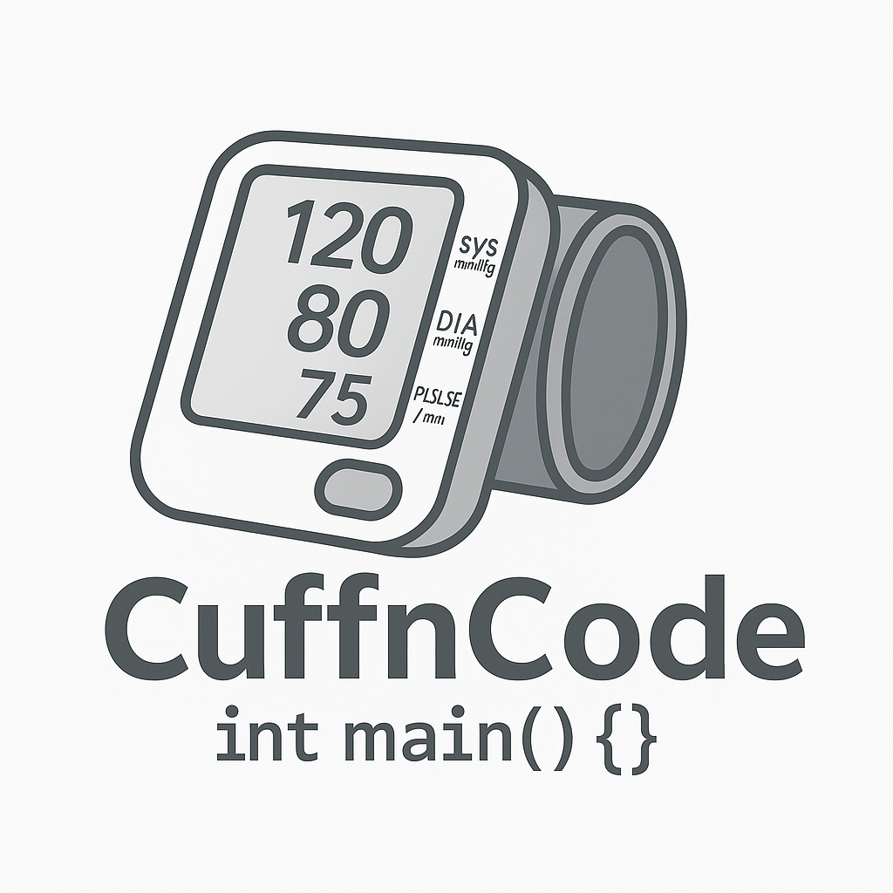

<p align="center">
  
</p>

<h4 align="center">Dibiayai oleh IFAC Activity Fund (July 2025 - June 2026)</h4>

<p align="center">
  <strong>CuffnCode</strong> — Sistem pengukur tekanan darah retrofitted untuk pengajaran dan penelitian.
</p>

<p align="center">
  <a href="./docs/index.html">Dokumentasi</a> •
  <a href="./docs/hardware/index.html">Hardware</a> •
  <a href="./docs/firmware/index.html">Firmware</a> •
  <a href="https://github.com/Student-Embedded-Control-and-AI-Fest/CuffnCode">GitHub</a>
</p>

---

## 📋 Ikhtisar Proyek

**CuffnCode** adalah sistem pengukur tekanan darah (*sphygmomanometer*) yang di-retrofit untuk keperluan pengajaran dan penelitian. Sistem ini menggunakan sensor tekanan MPS20N0040D dengan *Analog Front End* (AFE) berbasis AD620 dan TLC2272, serta dikontrol oleh mikrokontroler STM32F411CE (Black Pill).

### Fitur Utama
- ✅ Analog Front End low-noise dengan AD620 (gain ~105x) + TLC2272 (level shift ~1.5V)
- ✅ Sensor tekanan MPS20N0040D (millivolt bridge sensor)
- ✅ Digital controller STM32F411CE @ 100MHz
- ✅ Sampling ADC 12-bit @ 1kHz dengan DMA
- ✅ Filter digital: low-pass FIR, band-pass IIR, moving average, notch 50/60Hz
- ✅ Algoritma oscillometric untuk pengukuran SBP/DBP/MAP/HR
- ✅ Output data real-time via UART (CSV/JSON)
- ✅ State machine untuk kontrol inflasi/deflasi cuff

### Tujuan Jangka Panjang
Menjadi platform over-instrumented untuk pengembangan dan pengujian algoritma *signal processing* dan *control*.

---

## 📁 Struktur Proyek

```
CuffnCode/
├── Firmware/               # Firmware STM32F411CE
│   ├── Core/
│   │   ├── Inc/           # File header
│   │   ├── Src/           # Source code
│   │   └── Startup/       # Startup code + linker script
│   ├── Drivers/           # STM32 HAL Drivers + CMSIS
│   └── Makefile           # Build system
├── Hardware/               # Dokumentasi hardware
│   ├── KiCad/             # File PCB (KiCad)
│   └── TINA-TI/           # File simulasi (TINA-TI)
├── docs/                   # Dokumentasi GitHub Pages
│   ├── index.html         # Halaman utama
│   ├── hardware/          # Dokumentasi hardware
│   ├── firmware/          # Dokumentasi firmware
│   ├── assets/            # CSS, JS
│   └── images/            # Gambar dokumentasi
├── images/                 # Gambar proyek
└── README.md              # File ini
```

---

## 🔧 Hardware

### Analog Front End (AFE)
- **Instrumentation Amplifier**: AD620 (gain = 1 + 49.4kΩ/470Ω ≈ 105)
- **Level Shifter**: TLC2272 rail-to-rail op-amp
- **Offset**: (56k/(47k+56k)) × 3.3V ≈ 1.5V

### Sensor
- **MPS20N0040D**: Millivolt bridge sensor (50-100mV full-scale, 4-6kΩ)

### Digital Controller
- **STM32F411CE** (Black Pill): Cortex-M4F @ 100MHz, 512KB Flash, 128KB SRAM

### Komponen Lain
- Mini pump (KOGE KPM14A 3V atau ekuivalen)
- Solenoid valve 3V
- Cuff tensimeter dewasa standar
- MOSFET driver (IRLZ44N atau ekuivalen)

---

## 💻 Firmware

### Arsitektur State Machine
```
IDLE → (CMD 's') → INFLATING → (tekanan >= 180) → MEASURING
MEASURING → (tekanan < 20) → COMPLETE → IDLE
ANY → ERROR → IDLE
IDLE → (CMD 'd') → DUMP → IDLE
```

### Build & Flash
```bash
# Prerequisites: ARM GCC toolchain, STM32CubeProgrammer atau OpenOCD

cd Firmware
make all          # Build firmware
make flash        # Flash via ST-Link (STM32_Programmer_CLI)
make flash-openocd # Flash via OpenOCD
make clean        # Bersihkan build artifacts
```

### UART Command Interface
| Command | Fungsi |
|---------|--------|
| `s` | Mulai pengukuran |
| `d` | Dump data mentah (CSV) |
| `r` | Reset sistem |
| `h` | Help |

---

## 🧪 Algoritma Oscillometric

Metode oscillometric menentukan tekanan darah dengan menganalisis osilasi dinding arteri selama deflasi cuff:

1. **MAP** = Tekanan pada amplitudo osilasi maksimum
2. **SBP** = Tekanan pada 55% amplitudo maksimum (sisi tekanan tinggi)
3. **DBP** = Tekanan pada 75% amplitudo maksimum (sisi tekanan rendah)
4. **HR** = Dihitung dari frekuensi osilasi

---

## 🔜 Rencana Pengembangan

- [ ] Notch filter 50/60 Hz (*hum killer*)
- [ ] Layout PCB
- [ ] Evaluasi performa
- [ ] Kalibrasi dengan alat referensi (Omron)
- [ ] GUI desktop untuk data logging

---

## 🛡️ Keamanan

- Sensor MPS20N0040D fragile — hindari over-pressure
- Proteksi timeout pompa (30 detik)
- Emergency deflation via valve quick-dump
- Ground noise dari USB — ferrite pada kabel USB disarankan

---

## 📚 Referensi

- [Instrumentation Amplifier Intro](https://www.youtube.com/watch?v=O0-iczIq1aU)
- [INA333 Review with AD620 Suggestion](https://blog.robertelder.org/cjmcu-333-ina-333-instrumentation-amplifier/)
- [A Designer's Guide to Instrumentation Amplifiers](https://www.analog.com/media/en/training-seminars/design-handbooks/designers-guide-instrument-amps-complete.pdf)
- [STM32F411CE Datasheet](https://www.st.com/resource/en/datasheet/stm32f411ce.pdf)

---

## 🙏 Kredit

Proyek ini didanai oleh **IFAC Activity Fund** (July 2025 - June 2026).

<p align="center">
  <sub>© 2026 Tim CuffnCode</sub>
</p>
